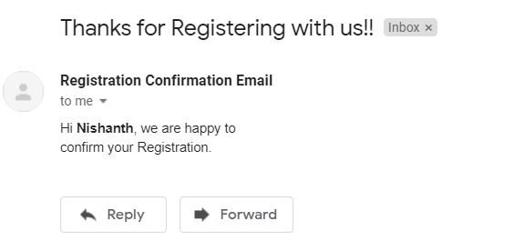
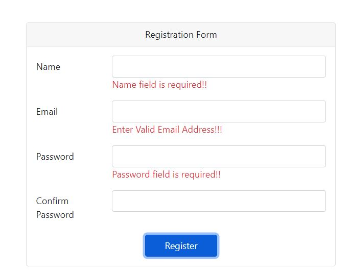
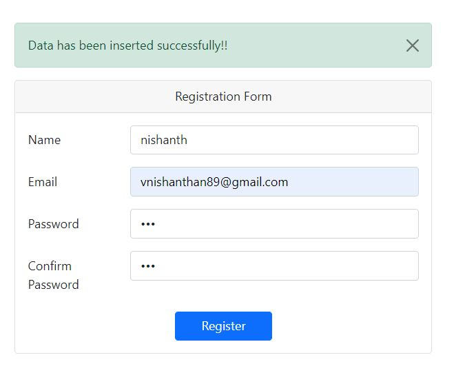

# test-php-app-instructions

<h1>Sending Mail to User</h1>

I have used PHP Mailer to sending Email

 
<h1>MySQL File</h1>

 I have attached the sql file which has the sample data which were stored into database while testing

<h1>Form Validation</h1>

I have performed both client-side validation and server side validation

 
<h1>Other comments</h1>

As mentioned in the task sheet, I have completed the other tasks as well, Also this task is in the ready state to upload in the production environment 

 

please use git clone repository_url(https) to download and view the source code

